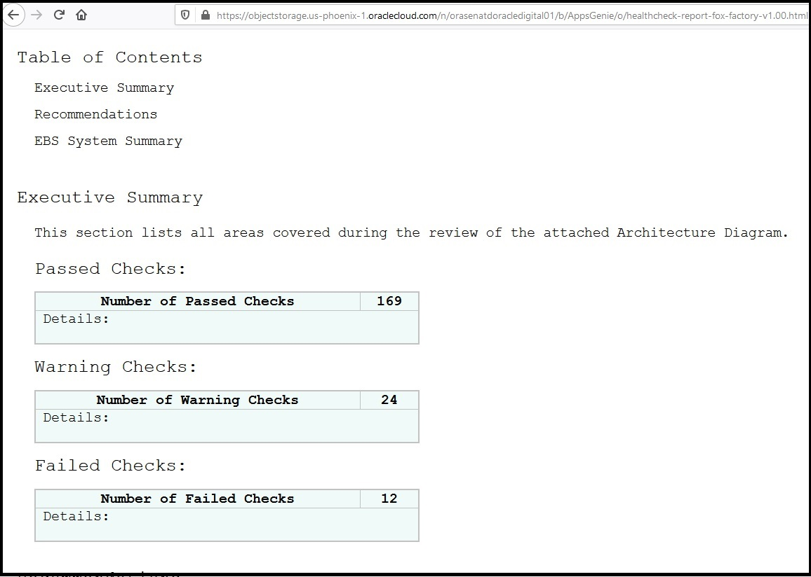
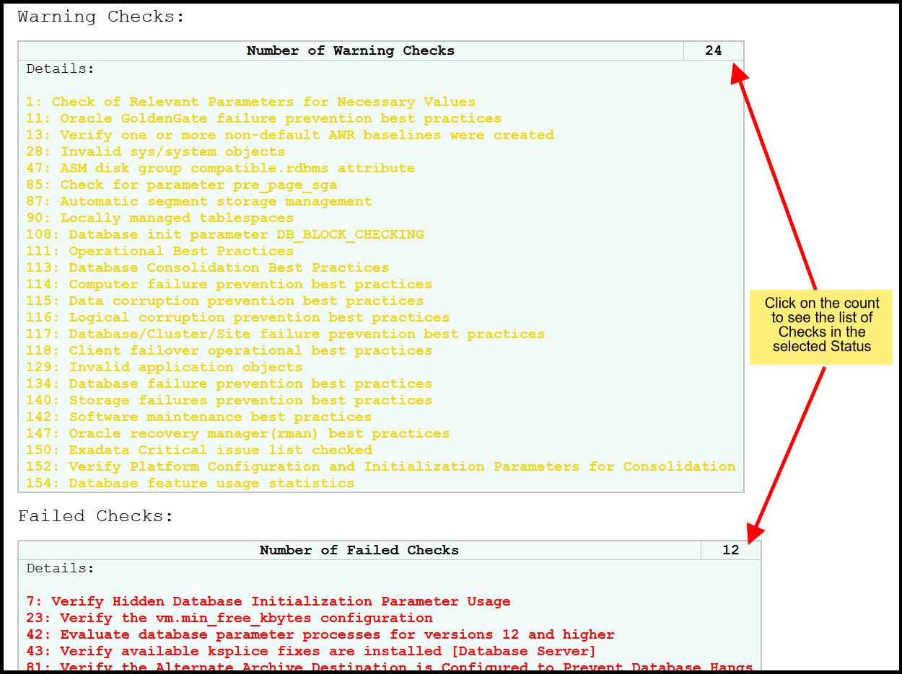
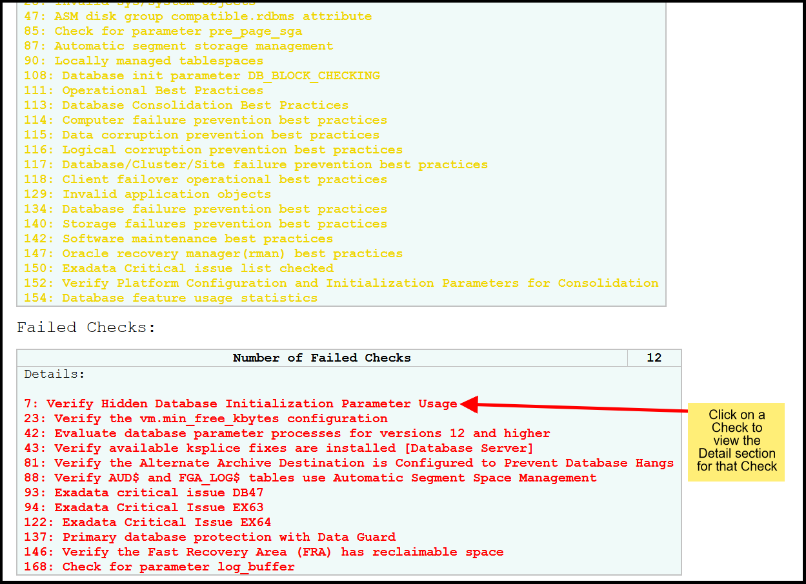
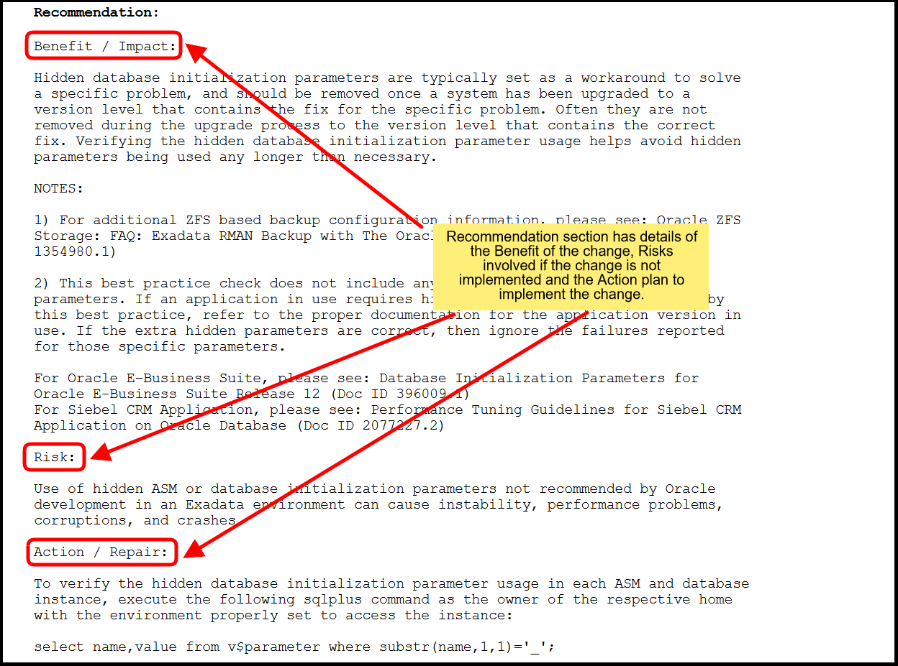
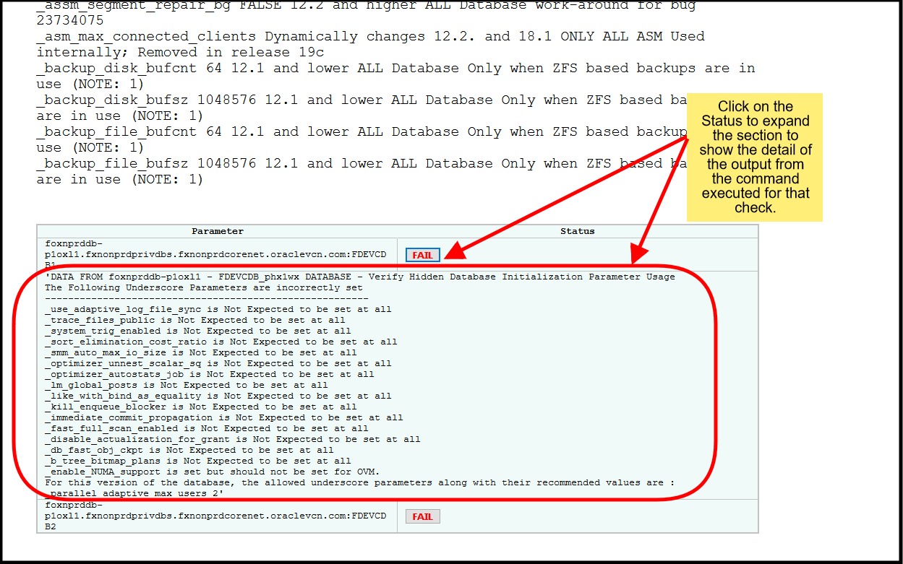

# EBS Health Check Tool

## Introduction

This tool provides a baseline for evaluating your EBS deployment for its cloud-readiness and production-readiness. The tool consists of two parts: **data collection** and **report generation**. The data collection part has three components: bdecheck, oracheck/exacheck, and manual check.

## Data Collection: BDE Check

This is one of three data pieces needed to generate the final report. You may find the file in this support document https://support.oracle.com/epmos/faces/DocumentDisplay?_afrLoop=490979140825047&parent=DOCUMENT&sourceId=2308463.1&id=174605.1&_afrWindowMode=0&_adf.ctrl-state=4llm0bpyc_53 or directly at this link https://support.oracle.com/epmos/main/downloadattachmentprocessor?parent=DOCUMENT&sourceId=174605.1&attachid=174605.1:SCRIPT_12108&clickstream=yes.

You must run the BDE Check on an APP node. This will generate an html file that will be used to create the final report.

### Prerequisites

1. Download the script from [this link](https://support.oracle.com/epmos/main/downloadattachmentprocessor?parent=DOCUMENT&sourceId=174605.1&attachid=174605.1:SCRIPT_12108&clickstream=yes).

### Steps to Run

1. Upload the script to an APP node. The script should be called `bde_chk_cbo_1208.sql`.
2. On that node, run the EBS environment file for that server with the "run" option. Generally this environment file is found at `/u01/install/APPS/EBSapps.env` but your environment may vary.
```
source /your/environment/file/here.env run
```
3. Run sqlplus using your credentials to log into the database.
```
sqlplus [username]/[password]
```
4. Run the script file. This should generate a spool file called `bde_chk_cbo_report.html`.
```
@bde_chk_cbo_1208.sql
```
5. Download the spool file to your local machine.

## Data Collection: ORA/EXA Check

This is one of three data pieces needed to generate the final report. You may find the AHF installation file at https://support.oracle.com/epmos/faces/DocContentDisplay?_afrLoop=491251169771167&id=2550798.1&_afrWindowMode=0&_adf.ctrl-state=4llm0bpyc_102: click "Download AHF" and follow the steps to install this on your EBS deployment.

You must run the ORA Check or EXA Check on a DB node. You should run it across all the DB nodes at once instead of individually since the report generation step only accepts one ORA/EXA report. This will generate a directory of multiple files - you will need `upload/#######_orachk_results.json` and `upload/orachk_recommendations.json` to create the final report.

### Prerequisites

1. Download the AHF installer at [this link](https://support.oracle.com/epmos/faces/DocContentDisplay?_afrLoop=491251169771167&id=2550798.1&_afrWindowMode=0&_adf.ctrl-state=4llm0bpyc_102).

### Steps to Run

1. Upload the installation zip to a DB node. This file is about 300MB so it should take some time. Then, unzip the file on that machine.
2. Install AHF on that machine by following the instructions in the unzipped README.txt.
3. Run the following:
```
./tfactl orachk
```
or, if you are using Exadata,
```
./tfactl exachk
```
4. Zip the generated folder, then download it to your local machine. Here is a possible location of where the folder `orachk_[DB NODE NAME]_[REST OF FOLDER NAME]` would be generated: `/u01/app/oracle.ahf/data/ebs2ndb2/orachk/user_root/output`.

## Data Collection: Manual Check

### What is this?

This is a Python program that will run a variety of checks over an EBS system. These are checks that are not covered by the BDE report or the ORA/EXA checks.

### Prerequisites - Information

Please ensure you have the following information from your EBS deployment:

- SSH key information† for each SSH key you need to log in to your Bastion hosts and VM servers:
    - Private key file locations used to SSH into your bastion host or directly into your VM servers††
    - Passwords for the private keys, if any
- Bastion host information for each Bastion host you have:
    - IP address
    - User to SSH in as (e.g. the `opc` in `ssh -i keyfile opc@123.456.78.90`)
    - Password for the user, if any
- VM server information for each node you have:
    - IP address
    - User to SSH in as (e.g. the `opc` in `ssh -i keyfile opc@123.456.78.90`)
    - Password for the user, if any
    - User to sudo as when running the EBS environment file
    - Password for the EBS user
    - Full path of the EBS environment file (e.g. `/u01/install/APPS/EBSapps.env`)
- Sqlplus username and password
<!-- - OCI Config information††† (exactly one, this config file is on the machine that is running this script):
    - Full path of the OCI config file (e.g. `/home/.oci/config`)
    - Profile to use inside this config file (e.g. "DEFAULT") -->

†: These SSH keys will need to be on the same machine as the script. Also, you may need to `chmod 400 [ssh key name]` since the script will fail if the permissions for the SSH keys are too open.

††: If you need to SSH into a Bastion server prior to accessing an APP/DB server, then the SSH key location to SSH into the APP/DB servers must be the filepath on the Bastion server. This means that you don't need to download the SSH keys from the Bastion servers to your local machines. Example: `ssh -i /Users/jdoe/.ssh/bastion_key opc@123.456.78.90` to enter the bastion and `ssh -i /home/opc/.ssh/demo opc@10.0.1.1` to enter the APP/DB node; the key file locations to record are `/Users/jdoe/.ssh/bastion_key` and `/home/opc/.ssh/demo` even though `/home/opc/.ssh/demo` is not on your local machine.

<!-- †††: For release 2.0, there are no OCI config checks, so no matter what you put for these settings, they will not be used. The OCI (Oracle Cloud Infrastructure) directory, which is generally at `~/.oci`, is generated when you install the OCI Command Line Interface. Part of this installation asks you for information that it will add to a config file under `~/.oci/config`. For more information on the OCI CLI, please visit [this site](https://docs.oracle.com/en-us/iaas/Content/API/Concepts/cliconcepts.htm). -->


### Prerequisites - Installation on Mac/Linux

**This section only applies to Mac/Linux users. For Windows users, please go to the below section**. If you are running these checks on your own machine, please ensure that the following prerequisites are satisfied.

1. **Python version**: This program has been tested on Python 3.6.0-3.9.6 and requires Python 3.x to run. Performance on other versions may vary. If your machine does not have Python 3 installed, please install it - you can find the most up-to-date version for your OS at https://www.python.org/downloads/. To check if you have Python 3, open a terminal window and run
    ```
    which python3
    ```
    If the terminal gives you the empty string, you do not have Python 3 installed. To check the version of Python, you may run:
    ```
    python3 --version
    ```
    To install Python 3, please follow these instructions:
    - Access the above link and download the latest version of Python 3 (yellow download button).
    - Run the installer and use all defaults in the installation wizard.
    - Once Python has been fully installed, open a terminal window and run the following:
        ```
        python3
        ```
        If the terminal does not immediately respond with the interactive Python interpreter (such as the following code block), please retry the installation above.
        ```
        Python 3.9.6 (v3.9.6:db3ff76da1, Jan 32 9999, 25:61:61) 
        [Clang 6.0 (clang-600.0.57)] on darwin
        Type "help", "copyright", "credits" or "license" for more information.
        >>> 
        ```
2. **Pip version**: This program uses pip3 to manage packages. Please ensure that it is installed and up-to-date. **If you installed Python 3 in step 1, the installer should have installed pip3 for you.** Otherwise, you can install pip by downloading the get-pip.py script at https://bootstrap.pypa.io/get-pip.py, then run it as such in your terminal:
    ```
    python3 get-pip.py
    ```
    You can check if you have pip already by running:
    ```
    which pip
    ```
    or
    ```
    which pip3
    ```
    You may have both python 2.x and 3.x installed; similarly "pip3" will be the alias for the pip installer for python 3.x libraries, whereas "pip" may install a python 2.x version of a library. Therefore you would run `which pip3` and `pip3` for all pip commands. **As of September 3 2021, the link above gets you pip version 21.2.3, which is incompatible with Python versions older than 3.6.**
3. **Install requirements**: The program depends on the modules specified in the `requirements.txt` file. Using your terminal, navigate to the directory where `requirements.txt` is located (use `cd /where/your/file/is/located`), then run the following command to install dependencies:
    ```
    pip3 install -r requirements.txt
    ```

### Prerequisites - Installation on Windows

**This section only applies to Windows users. For Mac/Linux users, please go to the above section**. If you are running these checks on your own machine, please ensure that the following prerequisites are satisfied.

1. **Bash Terminal**: You will need to use a bash terminal for running these scripts. This is not the same as Windows Command Prompt or Windows PowerShell. This guide uses Git Bash as the bash terminal of choice, which can be downloaded here: https://git-scm.com/downloads (the Windows downloadable is mainly for downloading Git, with Git Bash as a side option that you will need to check in the installation wizard). More detailed installation instructions for Git Bash below:
   - Go to the link above and download the Git installer. Generally you download the 64-bit installer, unless you are running this on a Windows machine that does not have a 64-bit processer (these are generally older computers). You may refer to guides like [this one](https://support.lenovo.com/us/en/solutions/ht117173-how-to-know-if-my-computer-is-32-bit-or-64-bit-windows) or search online to find out whether your machine is 64-bit or 32-bit.
   - Run the installation wizard. This will install Git, with the option to install Git Bash. Use all default options, but on the step where it asks whether to install Git Bash, make sure that box is checked.
   - Once Git and Git Bash are successfully installed, open Git Bash. If you cannot locate Git Bash on Cortana or by searching your apps, you will have to rerun the installation wizard. Once you have opened Git Bash, pin the app to your taskbar by right-clicking the Git Bash icon on your taskbar and selecting "pin app to taskbar". Some practice you can do now that you have Git Bash is to open multiple Git Bash terminals, as you may have one for running scripts and one for editing files. To open multiple terminal windows, right click on the Git Bash icon in your taskbar and select the "Git Bash" option, and repeat for more Git Bash windows.
2. **Python version**: This program has been tested on Python 3.6.0-3.9.6 and requires Python 3.x to run. Performance on other versions may vary. If your machine does not have Python 3 installed, please install it - you can find the most up-to-date version for your OS at https://www.python.org/downloads/. To check if you have Python 3, open Git Bash and run
    ```
    which python3
    ```
    If Git Bash gives you the empty string, you do not have Python 3 installed. Additionally, if it gives you a directory ending with `\Microsoft\WindowsApps` you will need to install Python 3.x since using the "python.exe" under this directory will redirect you to the Microsoft Store page rather than actually run Python. To check the version of Python, you may run:
    ```
    python3 --version
    ```
    To install Python, please follow these instructions:
    - Access the above link and download the latest Python 3 installer for Windows.
    - In the installation wizard, there will be an option to add the installation directory to Path - make sure this box is checked. Select the default installation.
    - Once Python has been fully installed, check your Path environment variable. You can do this by searching "environment variables" in Cortana or in Control Panel. This opens a properties window with an "Edit Environment Variables" button. Click this, then select the "Path" user environment variable and click the top edit button. If the installation was successful, you should see a string like `%USERPROFILE%\AppData\Local\Programs\Python\Python39` where the last folder is the Python version (this one is 3.9). **If you do not see any strings resembling the location of where you just installed Python, please locate this directory (it will contain "python.exe") and add a new environment variable with this directory.**
    - Finally, you will need to modify your Git Bash by adding an alias. Open a Git Bash terminal or use an existing one and run:
        ```
        echo 'alias python3="winpty python.exe"' > ~/.bashrc
        ```
        then close and reopen Git Bash so that the alias is loaded onto the new Git Bash window. You can test this by running the following in a Git Bash terminal:
        ```
        python3
        ```
        If the terminal does not immediately respond with the interactive Python interpreter (such as the following code block), please retry the installation above.
        ```
        Python 3.9.6 (v3.9.6:db3ff76da1, Jan 32 9999, 25:61:61) 
        [Clang 6.0 (clang-600.0.57)] on darwin
        Type "help", "copyright", "credits" or "license" for more information.
        >>> 
        ```
3. **Pip version**: This program uses pip3 to manage packages. Please ensure that it is installed and up-to-date. **If you installed Python 3 in step 2, the installer should have installed pip3 for you.** Otherwise, you can install pip by downloading the get-pip.py script at https://bootstrap.pypa.io/get-pip.py, then run it as such in your terminal:
    ```
    python3 get-pip.py
    ```
    You can check if you have pip already by running:
    ```
    which pip
    ```
    or
    ```
    which pip3
    ```
    You may have both python 2.x and 3.x installed; similarly "pip3" will be the alias for the pip installer for python 3.x libraries, whereas "pip" may install a python 2.x version of a library. Therefore you would run `which pip3` and `pip3` for all pip commands. **As of September 3 2021, the link above gets you pip version 21.2.3, which is incompatible with Python versions older than 3.6.**
4. **Install requirements**: The program depends on the modules specified in the `requirements.txt` file. Using your terminal, navigate to the directory where `requirements.txt` is located (use `cd /where/your/file/is/located`), then run the following command to install dependencies:
    ```
    pip3 install -r requirements.txt
    ```

### How To Run This

1. Generate the config file.
    - Prior to running the program, there are two prompts that you may skip for the current version of this script: `Would you like us to check if the source file exists(y/n)` and `Would you like to set up your OCI config? (y/n)` (just enter `n` for both of these). The first prompt will SSH into your configured VM to check if the environment file is there, which may take a long time and/or result in the program crashing. The second prompt will require you to enter a valid file prior to continuing.
    - If you get stuck while generating the config file, you may kill the script with ctrl+C. You will need to re-run the script again.
    - Navigate your terminal to the directory where `config_gen.py` is located. Start the config file program using the following code:
        ```
        python3 config_gen.py
        ```
        then answer the prompts as accurately as you can using the information gathered about your EBS environment. Alternatively, if you already have a config file **generated by this script**, you may use that.
    - Once `config.py` is generated, please move it to the same folder as `runner.py`.
2. Run the program.
    - Run the following:
        ```
        python3 runner.py
        ```
    - The script will automatically run on its own until successful completion or unresolved error. It will generate a folder containing the results JSON used to generate the final report as `results.json`, the SQL outputs from each SQL command as `SQL_RESPONSES.json`, and the logfiles for each IP under `LOGFILES/[IP address]`.

## Report Generation

### Prerequisites

1. This program has been tested on Python 3.6.0 and Python 3.8.6. Performance on other versions may vary. Please ensure that your system is configured appropriately. 
2. This program uses pip3 to manage packages. Please ensure that it is installed and up-to-date.
3. The program will utilize the following reports: BDE report, ORA/EXA check report, ORA/EXA check recommendations, and manual check results. It will also use the LOGFILE directory of the manual checks.
    - ORA check generates a folder with the following two files:
        - `orachk_[rest of folder name]/upload/#######_orachk_results.json`
        - `orachk_[rest of folder name]/upload/orachk_recommendations.json`
    - EXA check is similar to the above, but with "exa" instead of "ora"
    - BDE report is generally called `bde_chk_cbo_report.html`
    - Manual check results file is in a folder that is generated at the same level as the `runner.py` script. It is always called `results.json`.
```
ebs-healthcheck-report/
    runner.py
    [other files]
    RESULTS_[YYYY]-[MM]-[DD]T[HH]-[MI]-[SS]Z[TZ]/
        results.json                    # this is the manual check results file
        SQL_RESPONSES.json
        LOGFILES/
            [IP1]/
                ADOP_PATCHING_...       # this is a log file
                EBS_CONC_REQ...         # this is another log file
                ...
            [IP2]/
            [IP3]/
            ...
```

### How To Use This

1. Generate the config file.
    - Navigate to the `scripts` directory. You should see a `report_config.py` and `generate_report.py` file there.
    - Open `report_config.py` and input the five requested file locations:
        - **bdereport**: full path of BDE html report (something like `/home/.../bde_chk_cbo_report.html`)
        - **oracheck results**: full path of oracheck results json (something like `/home/.../#######_orachk_results.json`)
        - **oracheck reco**: full path of recommendation json (something like `/home/.../orachk_recommendations.json`)
        - **manual results**: full path of manual check results (something like `/home/.../RESULTS_#####/results.json`)
        - **manual logs**: full path of manual check logs directory generated by the manual check program (something like `/home/.../RESULTS_#####/LOGFILES/`) ***IMPORTANT: must include slash after "LOGFILES"***
    - There is an **ora or exa** option in `report_config.py`. Enter "exa" if your database is configured on Exadata, otherwise enter "ora". Save `report_config.py`.
2. Run the program.
    - Run the following:
        ```
        python3 generate_report.py
        ```
3. After script completion, a `healthcheck-report.html` file should have been generated in the main directory of this app.

# EBS Health Check Report

## Navigating The Report

A detailed Health Check report is generated after executing the Healthcheck scripts on an EBS Environment. The report will provide findings for Database, Application Tier and Technology components along with Recommendations for any checks that have warning or failed status.

The Executive Summary has a breakdown of the Health Checks by status - Passed, Warning or Failed.



You can view the list of Checks by clicking on the Count for that Status.


Click on any of the Checks to further navigate to the specifics of that Check.



Recommendation section for a check includes relevant information of the Benefits and Impacts of making the change, Risks involved if the change is not implemented and also a detailed Action Plan for implementing the Change. 



For every check clicking on the Status will expand the detail section that shows the output from the command(s) executed for that Check.


